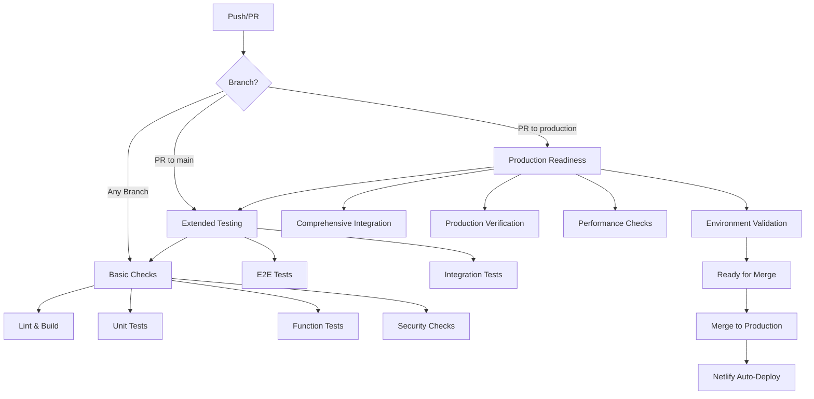

# GitHub Actions CI/CD Pipeline

## 🚀 **Overview**

VibeTrail uses **GitHub Actions** for comprehensive automated testing and deployment pipeline. The CI/CD system ensures code quality, security, and reliability before any production deployment.

---

## 🏗️ **Pipeline Architecture**



---

## 🧪 **Test Jobs Overview**

### **1. Lint and Build** *(All branches)*
- **ESLint** code quality checks
- **TypeScript** type checking
- **Build verification** with Vite
- **Artifact upload** for downstream jobs

### **2. Unit Tests** *(All branches)*
- **Vitest** component and service testing
- **Coverage reporting** with Codecov
- **React Testing Library** for UI components

### **3. Function Tests** *(All branches)*
- **Local Netlify Functions** testing
- **API integration** validation
- **Real API calls** with test credentials

### **4. E2E Tests** *(PRs to main/production)*
- **Playwright** browser testing
- **Full user journey** validation
- **Cross-browser compatibility**
- **Visual regression** testing

### **5. Security Checks** *(All branches)*
- **npm audit** for vulnerabilities
- **Dependency scanning** with audit-ci
- **High/Critical** vulnerability blocking

### **6. Integration Tests** *(PRs to production only)*
- **Complete API flow** testing
- **End-to-end function** validation
- **Real-world scenario** simulation

### **7. Production Readiness** *(PRs to production only)*
- **Build verification** for production
- **Environment validation** (secrets check)
- **Performance analysis** (bundle size)
- **Critical file validation**

---

## ⚙️ **Required Setup**

### **1. GitHub Secrets**

Go to **Repository Settings > Secrets and variables > Actions** and add:

```
OPENAI_API_KEY=your_openai_api_key_here
QLOO_API_KEY=your_qloo_api_key_here
```

### **2. Repository Settings**

#### **Branch Protection Rules**

**For `main` branch:**
```yaml
Protect matching branches: ✅
Require a pull request before merging: ✅
  - Require approvals: 1
  - Dismiss stale reviews: ✅
  - Require review from code owners: ✅
Require status checks to pass: ✅
  - Require branches to be up to date: ✅
  - Status checks:
    - Lint and Build
    - Unit Tests
    - Function Tests
    - E2E Tests
    - Security Checks
Require conversation resolution: ✅
Include administrators: ✅
```

**For `production` branch:**
```yaml
Protect matching branches: ✅
Require a pull request before merging: ✅
  - Require approvals: 2
  - Dismiss stale reviews: ✅
  - Require review from code owners: ✅
Require status checks to pass: ✅
  - Require branches to be up to date: ✅
  - Status checks:
    - All main branch checks +
    - Integration Tests
    - Production Readiness Check
Restrict pushes that create files: ✅
Require conversation resolution: ✅
Include administrators: ❌ (No bypassing for production)
```

---

## 🔄 **Workflow Triggers**

### **Automatic Triggers**
- **Push to main/production**: Runs basic checks
- **PR to main**: Runs extended testing suite
- **PR to production**: Runs comprehensive production readiness tests

### **Manual Triggers**
- **Workflow Dispatch**: Can be triggered manually from Actions tab
- **Re-run Failed Jobs**: Individual job re-runs available

---

## 📊 **Test Execution Details**

### **Parallel Execution**
Jobs run in parallel where possible for faster feedback:
```
├── Lint & Build (2-3 min)
├── Unit Tests (1-2 min)
├── Function Tests (3-5 min)
├── Security Checks (1-2 min)
└── E2E Tests (5-10 min) [depends on build]
```

### **Resource Usage**
- **Runner**: `ubuntu-latest`
- **Node.js**: Version 18
- **Timeout**: Varies by job (10-20 minutes)
- **Artifacts**: Build files, test reports, coverage

### **Environment Variables**
```bash
# Available in all jobs
NODE_ENV=test
CI=true

# Available in function/integration tests
OPENAI_API_KEY=${{ secrets.OPENAI_API_KEY }}
QLOO_API_KEY=${{ secrets.QLOO_API_KEY }}
NETLIFY_DEV=true  # For function tests
```

---

## 🚨 **Handling Test Failures**

### **Common Failure Scenarios**

#### **Lint Failures**
```bash
# Fix locally
npm run lint

# Auto-fix where possible
npx eslint . --fix
```

#### **Unit Test Failures**
```bash
# Run tests locally
npm run test

# Run with coverage
npm run test:run
```

#### **Function Test Failures**
```bash
# Test functions locally
npm run test:functions

# Test with Netlify dev
netlify dev &
NETLIFY_DEV=true npm run test:functions
```

#### **E2E Test Failures**
```bash
# Run E2E tests locally
npm run test:e2e

# Run with UI for debugging
npm run test:e2e:ui
```

#### **Security Audit Failures**
```bash
# Check vulnerabilities
npm audit

# Fix automatically where possible
npm audit fix

# Check specific issues
npx audit-ci
```

### **Debugging Failed Runs**
1. **Check job logs** in GitHub Actions tab
2. **Download artifacts** for detailed reports
3. **Re-run individual jobs** if needed
4. **Check environment variables** and secrets
5. **Verify branch protection** settings

---

## 📈 **Performance Monitoring**

### **Build Metrics**
- **Build time**: Target < 3 minutes
- **Bundle size**: Monitored and reported
- **Function size**: Optimized for cold starts

### **Test Metrics**
- **Test coverage**: Minimum 80% target
- **E2E test duration**: Target < 10 minutes
- **Function test response**: Target < 5 seconds

### **Success Rates**
- **Overall pipeline**: Target > 95% success
- **Production deployments**: Target > 99% success
- **Rollback frequency**: Target < 5% of deployments

---

## 🔧 **Maintenance Tasks**

### **Weekly**
- **Review failed tests** and patterns
- **Update dependencies** if needed
- **Check security alerts**
- **Review performance metrics**

### **Monthly**
- **Update GitHub Actions** versions
- **Review and update** test timeouts
- **Optimize test execution** time
- **Update documentation**

### **Quarterly**
- **Review branch protection** rules
- **Update security policies**
- **Performance optimization** review
- **CI/CD pipeline** improvements

---

## 📚 **Troubleshooting Guide**

### **Pipeline Not Running**
1. Check if GitHub Actions is enabled
2. Verify workflow file syntax
3. Check branch protection settings
4. Ensure secrets are configured

### **Tests Timing Out**
1. Increase timeout values in workflow
2. Optimize test execution
3. Check for infinite loops
4. Review resource usage

### **Function Tests Failing**
1. Verify API keys are set
2. Check Netlify CLI installation
3. Ensure function dependencies are installed
4. Validate function syntax

### **E2E Tests Flaky**
1. Add wait conditions
2. Increase timeouts
3. Use more specific selectors
4. Add retry logic

---

## 🎯 **Best Practices**

### **Writing Tests**
- **Fast and reliable**: Avoid flaky tests
- **Independent**: Tests don't depend on each other
- **Descriptive**: Clear test names and descriptions
- **Comprehensive**: Cover happy path and edge cases

### **CI/CD Optimization**
- **Parallel execution**: Run independent jobs in parallel
- **Fail fast**: Stop on first critical failure
- **Cache dependencies**: Use npm cache for faster builds
- **Artifact management**: Clean up old artifacts

### **Security**
- **Secret management**: Never expose secrets in logs
- **Dependency updates**: Regular security updates
- **Audit compliance**: Address high/critical vulnerabilities
- **Access control**: Proper branch protection rules

---

## 📊 **Monitoring Dashboard**

### **GitHub Actions Insights**
- **Workflow runs**: Success/failure rates
- **Job duration**: Performance trends
- **Resource usage**: Runner efficiency
- **Artifact storage**: Storage optimization

### **Key Metrics to Track**
- **Mean Time to Feedback**: Time from push to test results
- **Mean Time to Recovery**: Time to fix failed deployments
- **Deployment Frequency**: How often we deploy
- **Change Failure Rate**: Percentage of deployments causing issues

---

This comprehensive CI/CD pipeline ensures high code quality, security, and reliability for VibeTrail production deployments while maintaining developer productivity and fast feedback loops. 